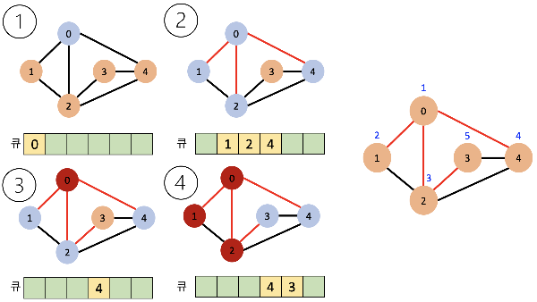

## BFS - 너비우선탐색

- 시작점에서 가까운 정점부터 순서대로 방문하는 탐색 알고리즘
- 큐를 이용해서 구현
- BFS 알고리즘
  1. 큐에 정점을 넣고 방문 표시
  2. 큐에서 dequeue를 통해 가장 앞에 있는 정점을 가져옴
  3. 정점과 연결된 노드 중 아직 방문하지 않은 노드를 순서대로 큐에 넣고 방문 표시
  4. 큐가 빌 때까지 2-3번 반복

- BFS 예시
  - 시작점인 0을 큐에 삽입하고 방문 표시
  - dequeue로 0을 삭제하고, 0과 연결된 노드 중 아직 방문하지 않은 노드(1,2,4)를 순서대로 큐에 넣고 방문을 표시
  - 큐가 빌때까지 2-3번을 반복해야하기 때문에 dequeue로 1을 삭제하고 1과 연결된 노드 중 아직 방문하지 않은 노드는 없음. 그 다음 dequeue로 2를 방문하는데 2와 연결된 노드 중 아직 방문하지 않은 노드인 3일 큐에 넣고 방문을 표시
  - 이 과정까지 마치면 현재 큐에는 {4, 3}이 남아있음. dequeue로 4를 삭제하고 (연결된 노드 중 방문 안한노드 없음) 그 다음으로 dequeue 하여 3을 삭제하고 큐가 비면 끝.
