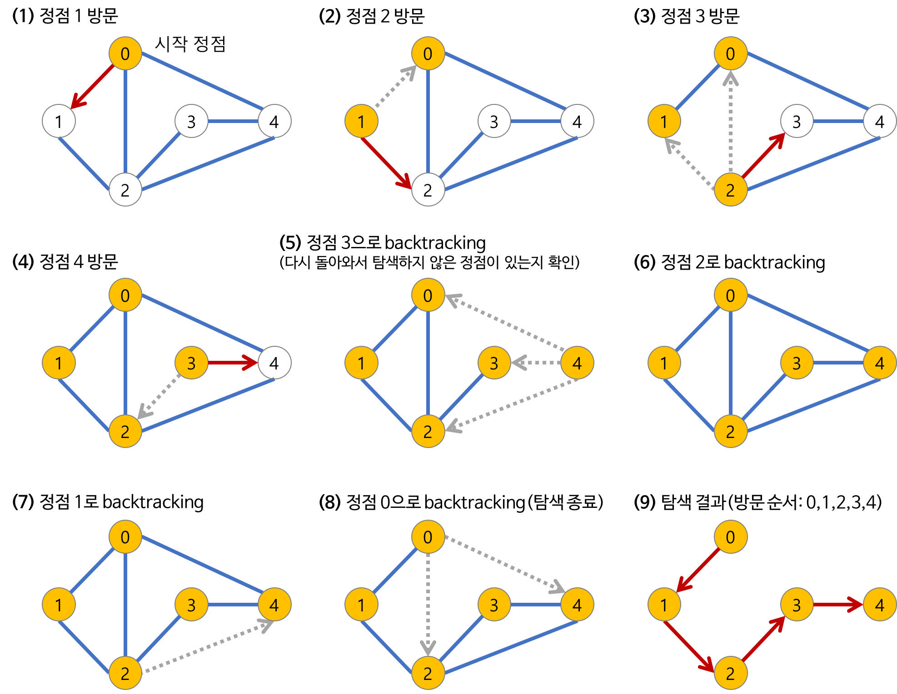

## DFS - 깊이 우선 탐색

- 루트 노드에서 시작해서 다음 분기(branch)로 넘어가기 전에 해당 분기를 완벽하게 탐색하는 방법
- 보통 트리 혹은 그래프 탐색에서 사용되는 알고리즘으로, 깊이를 우선하여 목표노드를 찾는 탐색법을 뜻한다.
- 넓게 탐색하기 전에 깊게 탐색하는 것이다.
- DFS 알고리즘
  1. 시작노드를 방문한다. 방문한 노드는 방문했다고 표시한다.
  2. a와 인접한 노드들을 차례로 순회한다. a와 인접한 노드가 없다면 종료한다.
  3. a와 인접한 노드 b를 방문했다면, a와 인접한 또 다른 노드를 방문하기 전에 b의 이웃노드들을 전부 방문해야한다. b를 시작정점으로 DFS를 다시 시작하여 b의 이웃노드들을 방문한다.
  4. b의 분기를 전부 완벽하게 탐색했다면 다시 a에 인접한 정점들 중에서 아직 방문이 안 된 정점을 찾는다. 즉, b의 분기를 전부 완벽하게 탐색한 뒤에야 a의 다른 이웃 노드들을 방문할 수 있다는 뜻이다. 아직 방문이 안 된 정점이 없으면 종료한다. 있으면 다시 그 정점을 시작 정점으로 DFS를 시작한다.

- DFS 예시  
  (1) 시작노드인 0을 방문하고, 방문 표시를 남긴다. (노란색으로 변경) 그리고 시작노드인 0과 인접한 정점 1을 방문하고, 방문 표시를 남긴다.  
  (2) 1과 인접한 노드를 살펴본다. 2와 인접해있고 아직 방문하지 않았기 때문에 방문하고 표시를 남긴다.  
  (3) 2와 인접한 노드를 살펴혼다. 3과 인접해있고 아직 방문하지 않았기 때문에 방문하고 표시를 남긴다.  
  (4) 3과 인접한 노드를 살펴본다. 4와 인접해있고 아직 방문하지 않았기 때문에 방문하고 표시를 남긴다.  
  (5) 4와 인접한 노드를 살펴본다. 모두 이미 방문한 노드이다. 따라서 다시 3으로 돌아가서 탐색하지 않은 정점이 있는지 확인한다.  
  (6) 3과 인접한 노드를 살펴본다. 모두 이미 방문한 노드이다. 따라서 다시 2로 돌아가서 탐색하지 않은 정점이 있는지 확인한다.  
  (7) 2와 인접한 노드를 살펴본다. 모두 이미 방문한 노드이다. 따라서 다시 1로 돌아가서 탐색하지 않은 정점이 있는지 확인한다.  
  (8) 1과 인접한 노드를 살펴본다. 모두 이미 방문한 노드이다. 따라서 다시 0으로 돌아가서 탐색하지 않은 정점이 있는지 확인한다.  
  (9) 0으로 돌아왔다. (시작노드로 돌아옴) 탐색 끝.  
- 탐색 결과 : 방문 순서 0 1 2 3 4
