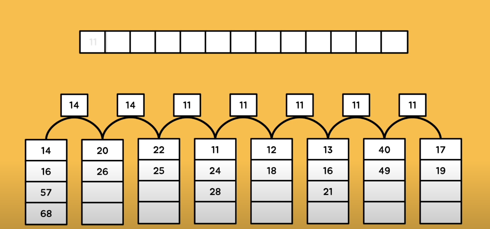
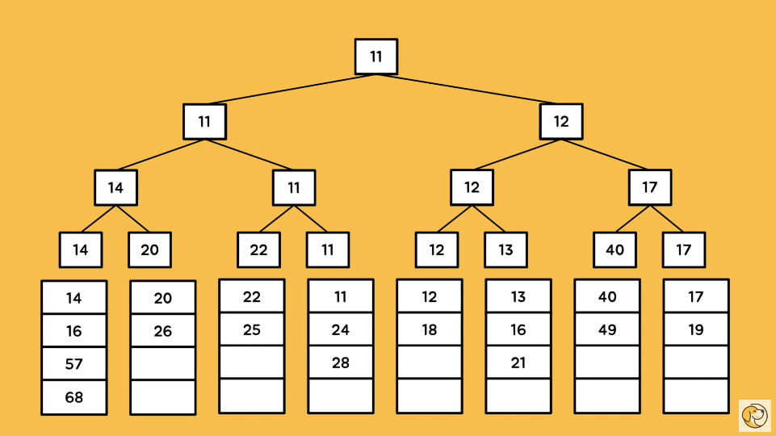
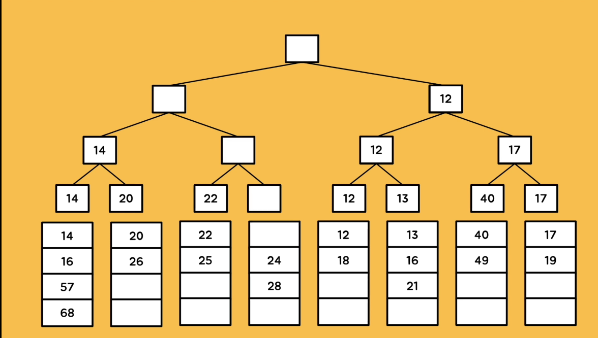

# 선택트리 (Select Tree)
- 선택 트리는 합병 정렬에 사용하는 특수한 구조를 가지는 트리 자료구조
- 주어진 k개의 정렬된 런(runs)을 하나의 정렬된 순서순차로 합병하는 과정을 나타내는 트리 자료구조 이다.

## 합병 정렬
- 각각 차례로 정렬된 n개의 데이터 리스트들을 완전한 순서를 유지하는 하나의 리스트로 병합하는 과정
- 각 리스트의 최솟값(최댓값)들을 비교해야 하기 때문에 한 번 합칠때마다 (n-1)번의 비교횟수가 필요하다. 전체 원소가 k개라면, k-1 번의 비교가 필요하다. => 낭비

- 그래서, 선택 트리를 이용하여 비교횟수를 줄인다.

## 승자 트리

작은 숫자들이 올라간다. 가장 작은 숫자를 찾는 것이 원칙이기 때문에, 작은 숫자가 승자가 된다.  
첫 연산은 위의 사진과 같이 k-1 로 동일하다. (8가지 원소에서 7번 비교)  

하지만, 두번째 연산부터는 기존 연산을 활용하기 때문에 연산의 횟수가 줄어든다.  

첫 번째 승자인 11을 지우고, 기존에 계산했던 것은 건들지 않기 때문에 빈 공간들에 해당하는 비교만 하면 된다.  
기존 연산을 활용해 두번째 연산은 3번으로 줄어들었다. 

## 패자 트리

---
[참고 유튜브](https://www.youtube.com/watch?v=YW1NO510FGk)